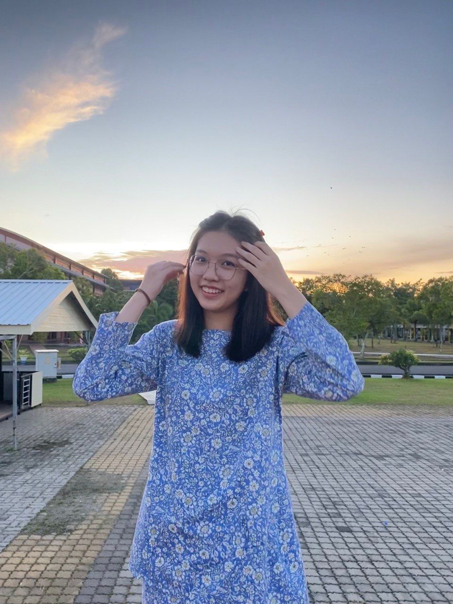
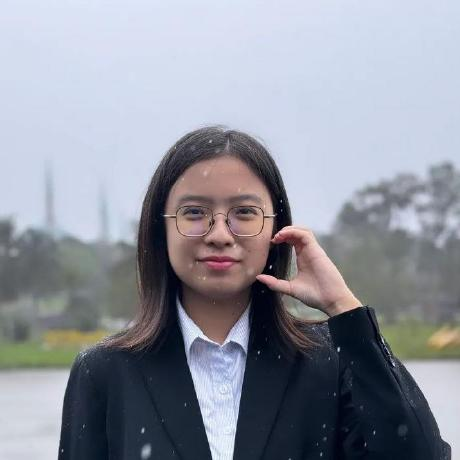
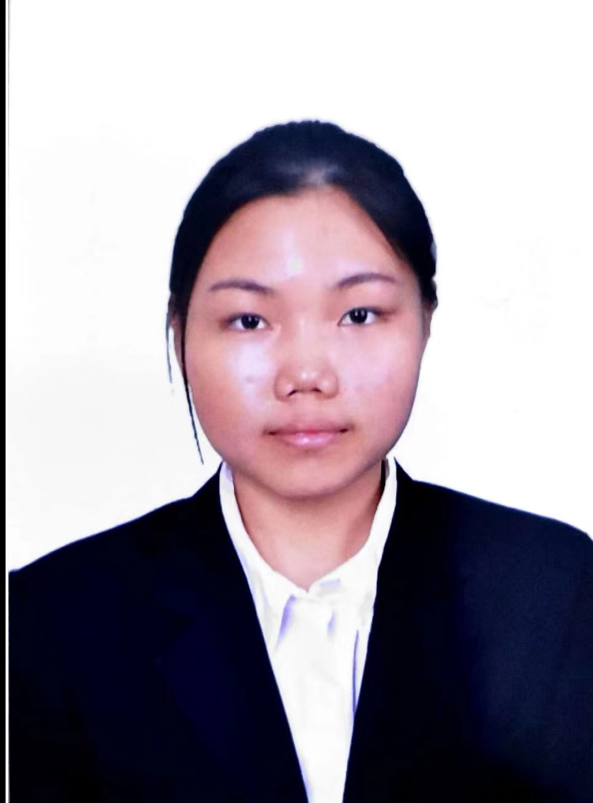
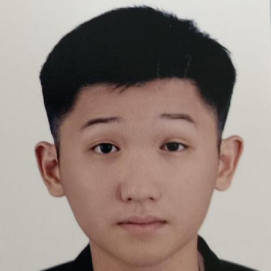

# LibraSync — An Improved Library Management System Project

## Description
-Phase1: Project Proposal and Planning (Report: [proposal](https://github.com/tkeqin/Seven-Teen_Project1_SAD_20232024/blob/a108820ea790571409c456c74aa7b93c94db553a/proposal))

## Group Member 🧑‍💻

| Name             | Matric Number | Photo                                                         |
| :---------------- | :-------------: | :------------------------------------------------------------: |
| Tan Keqin        | A23CS0184        |     |
| Lee Lai Queen         | A23CS0100        | |
| Yong Jing Wen            | A23CS0202     |     |
| Wong Shi Yun                | A23CS0198        |          |
| Benjamin Chew Jun Jie                | A23CS0210        |          |
